# My macOS set up

An single page doc that describes the apps and tools I use on macOS. I am - as of September 2020 - using a 2019 MacBook Pro 15 with a 2.4 GHz i9 CPU, 32GB RAM and a 1TB SSD. I'm running macOS 10.15.6 and, most importantly, this is my [wallpaper](https://unsplash.com/photos/0lQFV7CeghM).

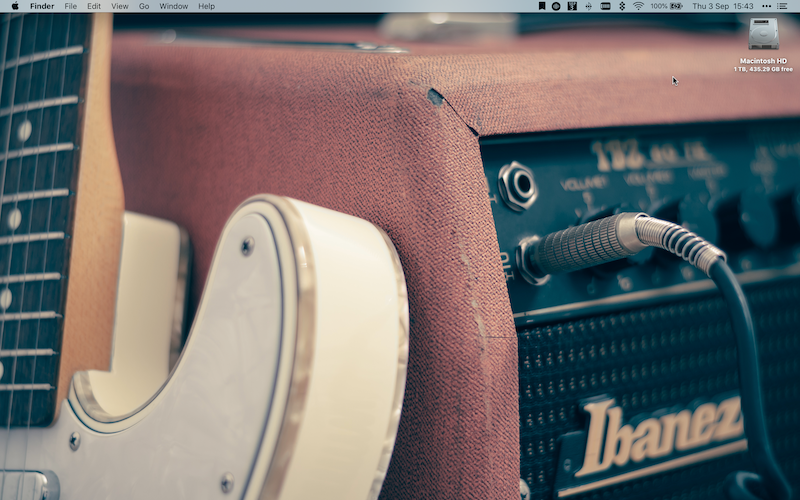

## Contents

* [Code](#code)
* [Communication] (#communication)
* [Design](#design)
* [Internet](#internet)
* [Music](#music)
* [Office](#office)
* [Productivity](#productivity)
* [Terminal](#terminal)
* [Video](#video)
* [Writing](#writing)

## Code

### [Kaleidoscope](https://www.kaleidoscopeapp.com) — File and text comparison
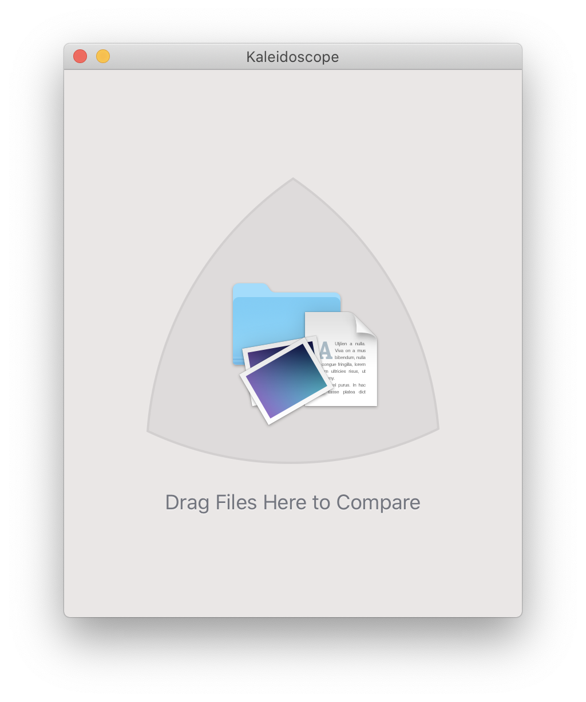
Awesome file and text comparison tool. Easy to use and well designed. Also usable on the command line via `ksdiff` or `git difftool` (for the latter you need to follow the integration instructions).

### [Sublime Text](https://www.sublimetext.com) — Text Editor
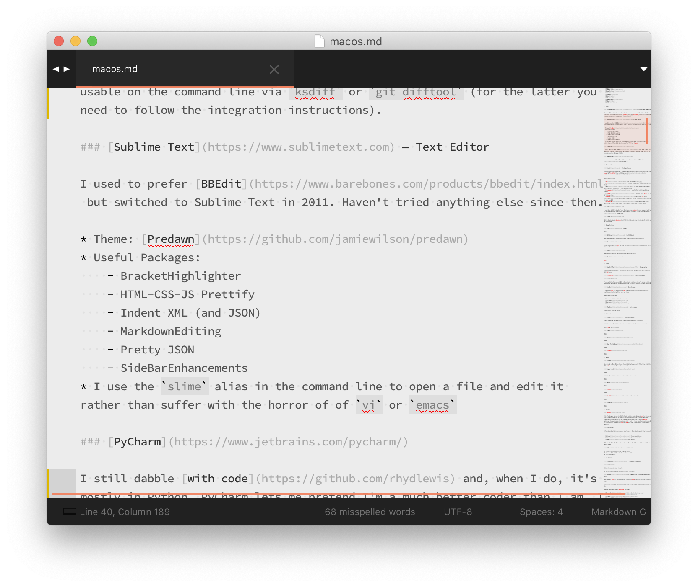
I used to prefer [BBEdit](https://www.barebones.com/products/bbedit/index.html) but switched to Sublime Text in 2011. Haven't tried anything else since then.

* Theme: [Predawn](https://github.com/jamiewilson/predawn)
* Useful Packages:
    - BracketHighlighter
    - HTML-CSS-JS Prettify
    - Indent XML (and JSON)
    - MarkdownEditing
    - Pretty JSON
    - SideBarEnhancements
* I use the `slime` alias in the command line to open a file and edit it rather than suffer with the horror of using `vi` or `emacs`

### [PyCharm](https://www.jetbrains.com/pycharm/)

I still dabble [with code](https://github.com/rhydlewis) and, when I do, it's mostly in Python. PyCharm lets me pretend I'm a much better coder than I am. I have to use the debugger A LOT.

### [SourceTree](https://www.sourcetreeapp.com)

A crutch because my command line Git skills are mediocre at best. I hear [GitFox](https://www.gitfox.app) is also good...

## Communication

### [Hey](https://www.hey.com) — Email
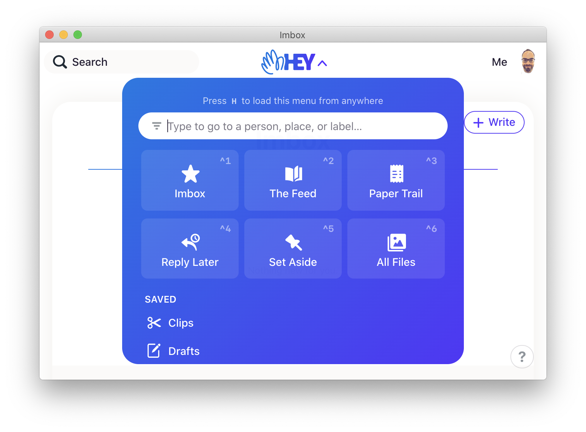
Hey as an idea and an email service is great. Hey as an email client is... not so good. Still early days though so looking forward to what's to come.

### [MailMate](https://freron.com) - Email Client

The best IMAP email client available. Searching is lightning fast and I can write emails in Markdown. 👍

### [Meeter](https://trymeeter.com)

Handy little menu bar app to help you join a video call irrespective of which video calling service in use.

### [Slack](https://www.slack.com)

Goes without saying. Which companies don't use Slack?

### [Zoom](https://www.zoom.us)

Meh.

## Design

### [OmniGraffle](https://www.omnigroup.com/omnigraffle) — Diagramming

Decent diagram tool but I cannot for the life of me get it to print a diagram on an A4 bit of paper without repeatedly fiddling with the margins. I am doing something very, very wrong I fear.

### [Pixelmator](https://www.pixelmator.com/mac/) — Graphics Editor

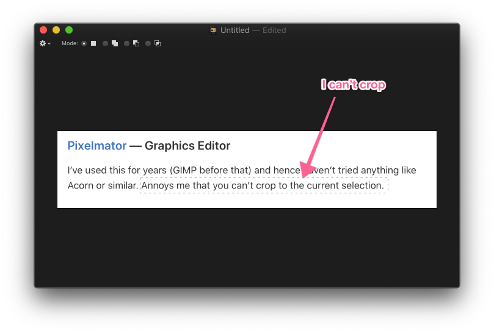

I've used this for years and hence haven't tried anything like Acorn or similar. Annoys me that you can't crop to the current selection. I should try Acorn or something similar.

### [IconJar](https://geticonjar.com) — Icon Browser

I love this. An easy to use app for searching and cataloguing icons. Never thought I'd say that but there you go. Useful when trying to find, err, an icon.

Some useful icon sets:

* [Hero Icons](https://heroicons.com)
* [Flat Icons](https://www.flaticon.com)
* [Game Icons](https://game-icons.net)
* [Font Awesome](https://fontawesome.com)

### [Typeface](https://typefaceapp.com) — Font Browser

Like IconJar but for fonts.

## Internet

### [Better](https://better.fyi) - Content blocker

Does a good job of weeding out ads and unwanted stuff like that.

### [Browser Fairy](https://www.browserfairy.com) - Browser management

Great app, terrible name. Allows me to choose which browser to open depending on the domain name or other such rules. So, work stuff in Firefox, personal stuff in Safari. Keep it separated is the name of the game.

### [Focus](http://heyfocus.com) - Internet blocker

Sometimes I need to block out the internet. This app allows me to specify a set of sites (e.g. news, Gmail) and apps to block (e.g. mail) and then, for a period of time, prevents a professional procrastinator like me from accessing them.

### [Safari](https://www.apple.com/lae/safari/) - Browser

Default browser. Used for personal stuff.

### [Stop The Madness](https://underpassapp.com/StopTheMadness/)

A browser extension that prevents sites from "making your browser harder to use". Effectively it stops a site from employing Javascript to prevent use of the context menu or copy and paste. Really handy.

### [Firefox](https://www.firefox.com) - Browser

Alternative browser. Used for work stuff.

## Music

### [Fission](https://www.rogueamoeba.com/fission/) — Audio Editor
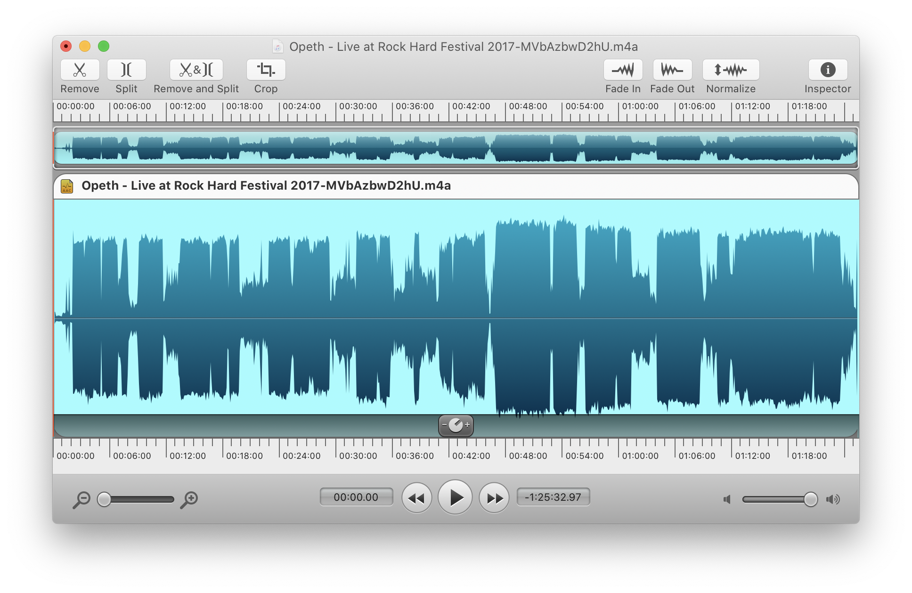
Very handy audio editor. Great for splitting large audio files into multiple files (i.e. when downloading a live concert from YouTube). I do this quite often and then end up never listening to the concert. It's a compulsion, what can I say?

### [Logic Pro X](https://www.apple.com/logic-pro/) — DAW
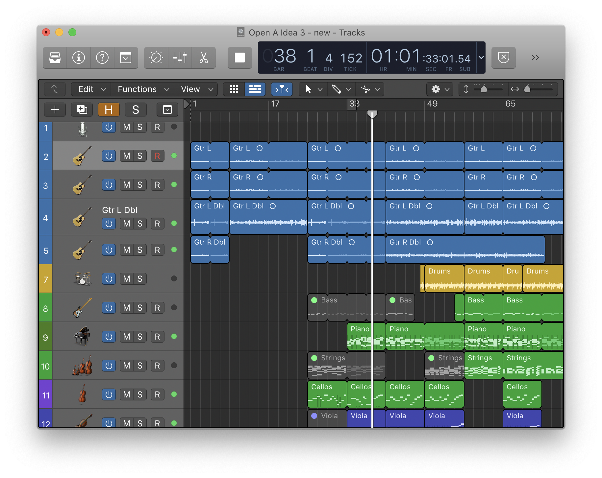
Apple's digital audio workstation. I spend far too much time fiddling with existing ideas as opposed to actually recording a song from start to finish. Fantastic app though. Immense fun.

### [NepTunes](https://micropixels.software/neptunes) — Last.fm scrobbler

I still use [last.fm](https://www.last.fm) and have done so since 2005. [This is me](https://www.last.fm/user/rgl). This app is a decent scrobbler.

### [Music](https://www.apple.com/music/) — Music Player

I'm happy with Apple's <del>iTunes</del> Music app. Does the job well. I've got - crikey - 12,325 songs all in all. Here are 3 random but useful smart playlists:

* Top 250 played songs
* Rated ≥ 4★
* Not Rated & Not Played in the last year

### [Noizio](https://noiz.io) — White Noise Generator

When trying to concentrate I like listening to the sound of rain and a gale blowing.

### [Spotify](https://www.spotify.com/) — Music Player

I used to subscribe to Apple Music and Spotify before realising the futility of dealing with and paying for 2 streaming services at once. More recently, I've become more in favour of buying albums rather than streaming music. I would like to bin Spotify soon.

### [TuxGuitar](http://tuxguitar.com.ar) — Guitar Tablature Player

The PowerTab editor on Windows was a great app for me in the 2000's. I use Tux Guitar on the Mac now. Does the job well.

## Office

### [Gnucash](http://gnucash.org/)

Bit of a bugger to use (and definitely not the best designed app in the world) but it does a good job of keeping track of my finances. I have imported, converted and munged all of my records since 2005 into a single Gnucash database. It took _some_ time to do but - hey! - I can now look back at wonder at how little I saved in my 20s and 30s to become somewhat vexed with myself. 

### iLife Suite

It's not called this any more but I don't care, I'm sticking with it. I use:

* [KeyNote](https://www.apple.com/keynote/) for presentations
* [Numbers](https://www.apple.com/numbers/) for spreadsheets
* [Pages](https://www.apple.com/pages/) for writing

All standard stuff. I'm happy not to use Microsoft Office as it's overkill for what I need.

### [PDFPen](https://smilesoftware.com/PDFpen/)

1. Useful for electronically signing PDFs.
2. Also good for filling in forms that are PDFs. 
3. PDFs are boring.

## Productivity

### [1Password](https://1password.com) — Password management

> Keep it secret, keep it safe

My secret key and master password are... no, wait.

### [Alfred](https://www.alfredapp.com) — Productivity, Launcher and so much more

The best Mac app bar none. Used for launching apps, running scripts and what not.

> Since 19 Nov 2019, Alfred has been used 11,368 times. Average 39.2 times per day.

Some of the most useful workflows include:

* [Change Case](https://github.com/gillibrand/alfred-change-case)
* [Colors](https://github.com/TylerEich/Alfred-Extras)
* [Convert](https://github.com/deanishe/alfred-convert)
* [Open in Sublime](http://alfred.daniel.sh)
* [Rusty Pin](https://github.com/spamwax/alfred-pinboard-rs) - Pinboard helper
* [Safari Assistant](https://github.com/deanishe/alfred-safari-assistant/)

I also use my own workflows:

* [Search Omnifocus](https://github.com/rhydlewis/search-omnifocus) - to search OmniFocus data ([more musings on this](https://rhydlewis.net/tags/#workflow))
* [Shortcuts](https://github.com/rhydlewis/shortcuts_workflow) - a collection of shortcuts to convert text, add an entry to Fantastical, etc.

### [Annotate](https://apps.apple.com/us/app/annotate-capture-and-share/id918207447) — Screenshot annotations

Very simple and easy to use screenshot annotation app.

### [Bartender](https://www.macbartender.com) — Menu bar icon organiser

Great idea for an app. Without it, the Mac menu bar is too cluttered. This creates a hidden area for rarely used icons so that my menu bar shows only the apps I need to see. Brilliant.

### [BetterTouchTool](https://www.boastr.net/) — Mac input customizer

For customised trackpad gestures e.g.:

* 5 finger tap ⇒ maximises the current window
* ⌘ + 2 finger swipe left ⇒ move window to left side of screen
* ⌘ + 2 finger swipe right ⇒ move window to right side of screen

I recall having more than just this. I think I'm only using 1% of the capabilities of this app.

### [DaisyDisk](https://daisydiskapp.com)
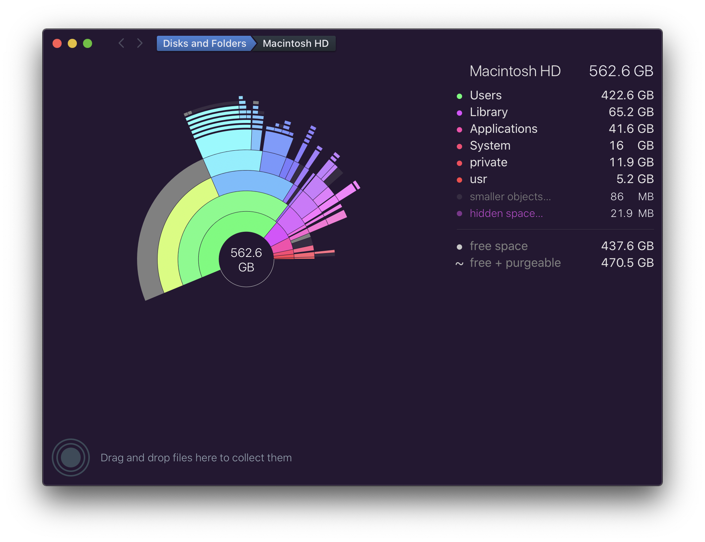
My last MacBook had only 256GB storage (I know right?) so I was forever trying to free up space. Less of a problem now.

### Dictionary

I use the built-in macOS Dictionary multiple times each day via the Alfred `d` shortcut

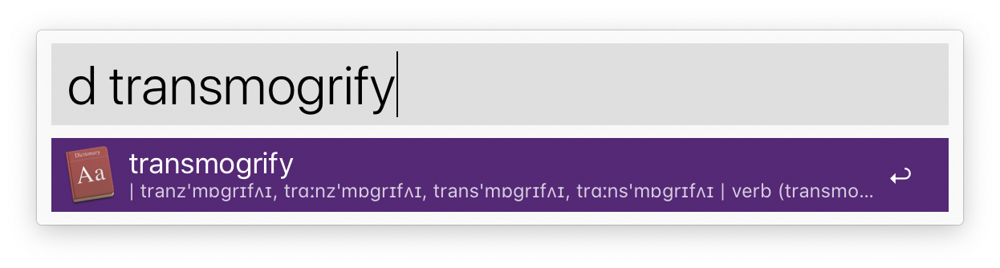

### [Fantastical](https://flexibits.com/fantastical) — Calendar
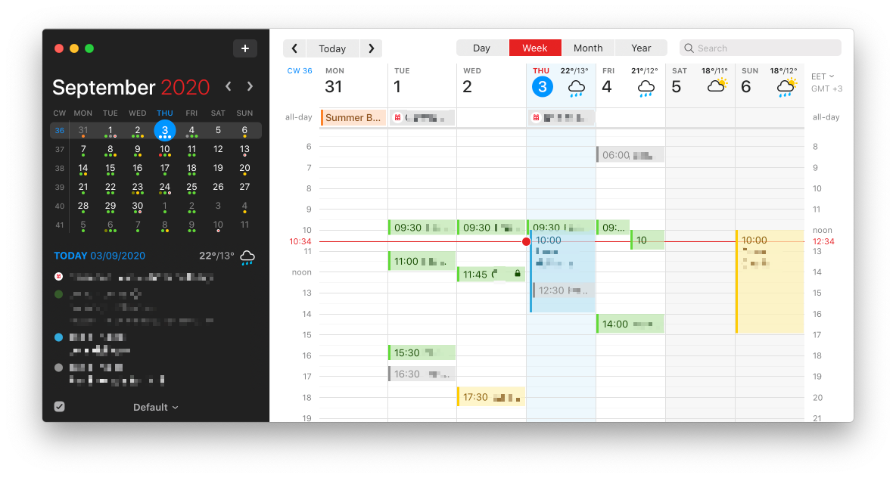
Fantastic (sorry) calendar app supporting iCloud, Google and Outlook calendars.

### [OmniFocus](https://www.omnigroup.com/omnifocus) — Task manager
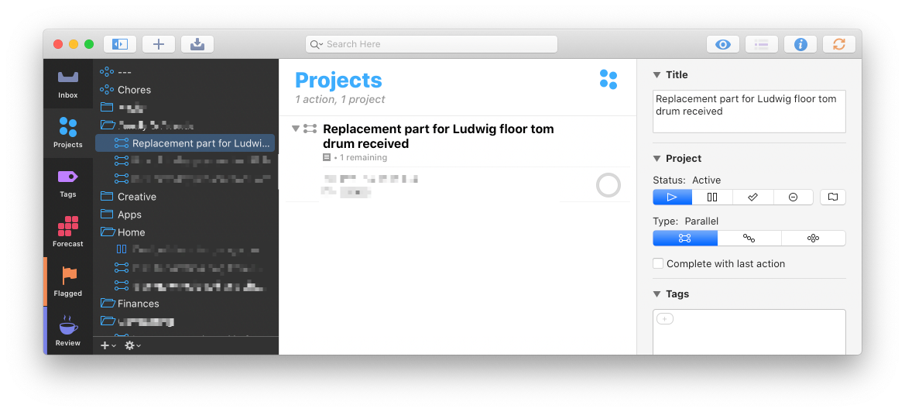
The best task manager hands down. Slight caveat: I haven't tried any others. Also see my other [musings on OmniFocus](https://rhydlewis.net/tags/#omnifocus).

> Note, as of writing, the replacement part for Ludwig floor tom still hasn't arrived. This is frustrating.

### [Text Expander](https://textexpander.com) — Text expansion
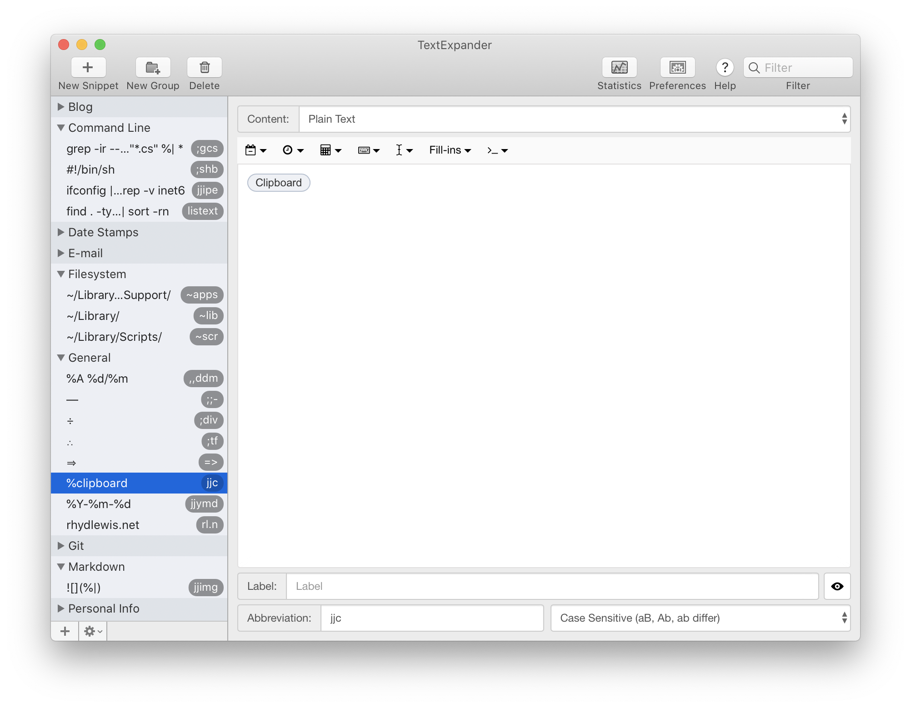
Useful short cuts to save typing time. For example, typing:

* `jjc` ⇒ a plain-text version of whatever's in the clipboard (I know ⌘-⇧-V achieves the same result but I prefer this shortcut instead) - **incredible!**
* `jjeh` ⇒ my Hey email address - **wowsers!**
* `;;-` ⇒ transmogrifies into an em-dash (—) - **amazing!**

and so on. Why I use a mix of `;;` and `jj` as prefixes instead of choosing just one is now, sadly, lost in the midsts of time.

## Terminal

### [Brew](https://brew.sh) — Package Manager

Easy to use package manager. Saves time finding and installing utilities and apps. My `brewfile` [is available here](https://github.com/rhydlewis/setting-up-a-new-mac/blob/master/Brewfile).

Some useful casks:

- [exa](https://github.com/ogham/exa) — a replacement for `ls`
- [fd](https://github.com/sharkdp/fd) — Faster and so much less annoying than `find`
- [mas](https://github.com/mas-cli/mas) — It's a CLI for the Mac AppStore - only used when setting up a new MacBook really
- [imagemagick](http://www.imagemagick.org) — useful for batching editing images
- [ripgrep](https://github.com/BurntSushi/ripgrep) — Better than `grep` in 99% of all searches
- [thefuck](https://github.com/nvbn/thefuck) — A "magnificent app that corrects errors in previous console commands". Rarely used but I enjoy using it when needed
- [youtube-dl](https://github.com/rg3/youtube-dl) — Download videos (and optionally convert into audio) from YouTube and a host of other sites

### [Fish](https://fishshell.com) 

I use this shell instead of your Bashes or your zshes because someone told me it was better and I took their word for it. Diligent. I use the [Starship](https://starship.rs) prompt too.

### [iTerm 2](https://iterm2.com)

Much better than the built in macOS Terminal app because you can configure it to display in a Quake-style using the same shortcut key (⌘-§) to hide and show the terminal at the top of the screen.

## Video

### [IINA](https://github.com/lhc70000/iina) — Video player

An alternative to - and better version of IMO - VLC which is what I used previously.

### [iMovie](https://www.apple.com/imovie/)

Bit of a clunky app but it's easy to edit videos which is really all I need to do.

## Writing

### [Bear](https://www.notion.so/) — Note taking

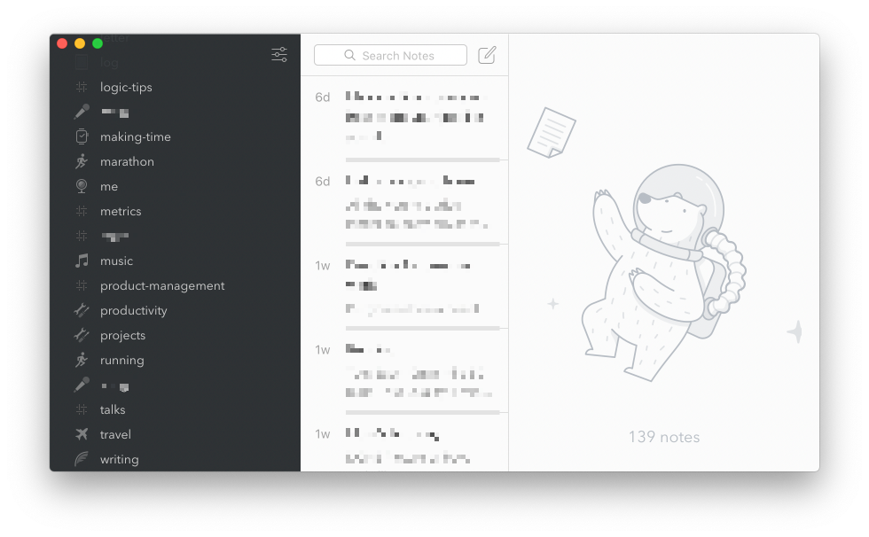

Well-designed, Markdown style note taking app. Ideas, lists and other assorted stuff goes in here. I should probably move everything from Bear into Notion or vice versa. Can't decide.

### [DayOne](https://dayoneapp.com) — Journalling

I go through phases of capturing my thoughts on a regular basis then a semi-regular basis until finally ending up not using this app for months. Must try harder. I used it to capture photos and stuff my kids said when they were small that I've now forgotten. It's fun to look back at this every now and then.

### [iThoughtsX](https://www.toketaware.com/ithoughts-osx) — Mind mapping

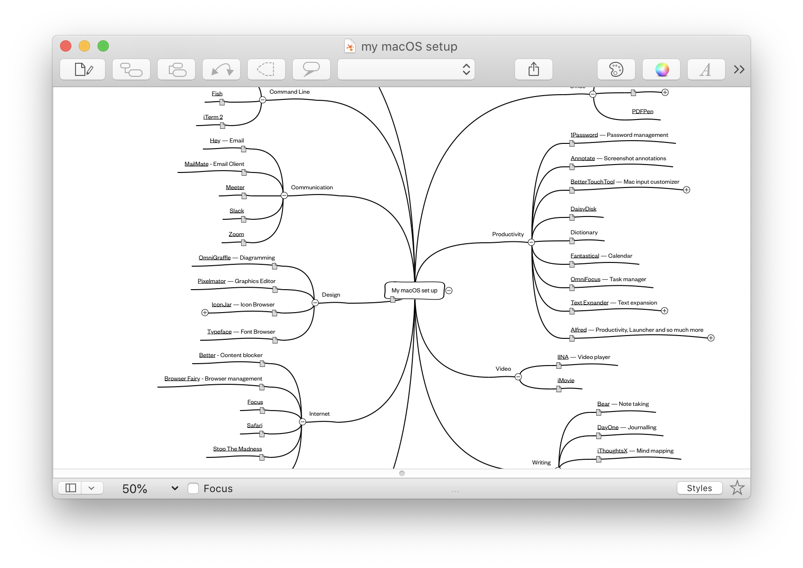

I don't know about you but I bloody _love_ a mind map. If I'm struggling to write something or come up with some possible solutions for a problem, I use this app to help me associate and arrange ideas visually.

### [Marked](https://marked2app.com) — Markdown previewer

I write most of my notes in [Markdown](https://daringfireball.net/projects/markdown/) and this app helps me see what the rendered output looks like.

### [Notion](https://www.notion.so/) — Note taking

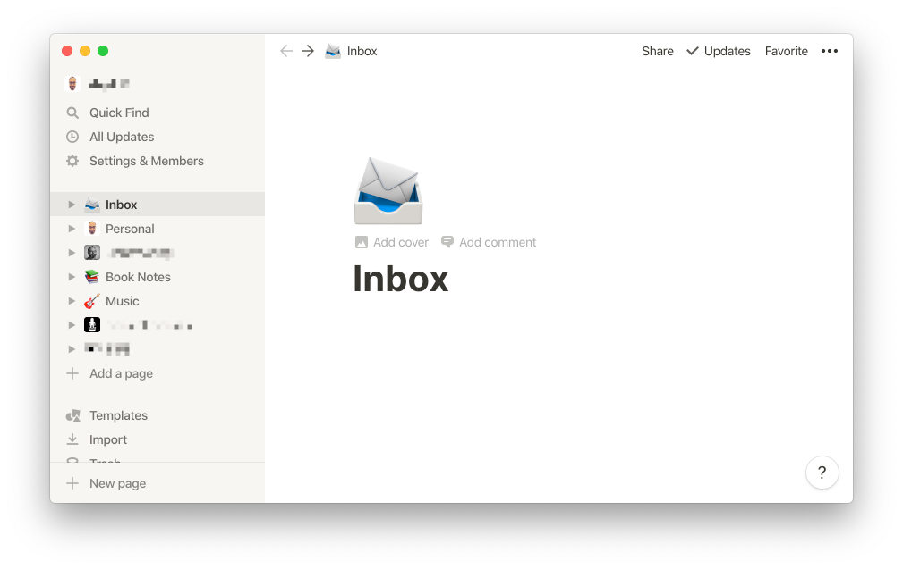

My day-to-day note taking and reference app. I'm sure it can do more than I use it for. Not overly keen on the way each block has it's own ID as this means normal text editing shortcuts don't always work. Also, the built in tables are a load of old claptrap. I like that you can split content into sections (something that [Bear](#bear) doesn't do so well).

### [Ulysses](https://ulysses.app) — Writing

I use this for any long-form writing that I'm most definitely procrastinating on. Haven't touched it in months (more's the pity).